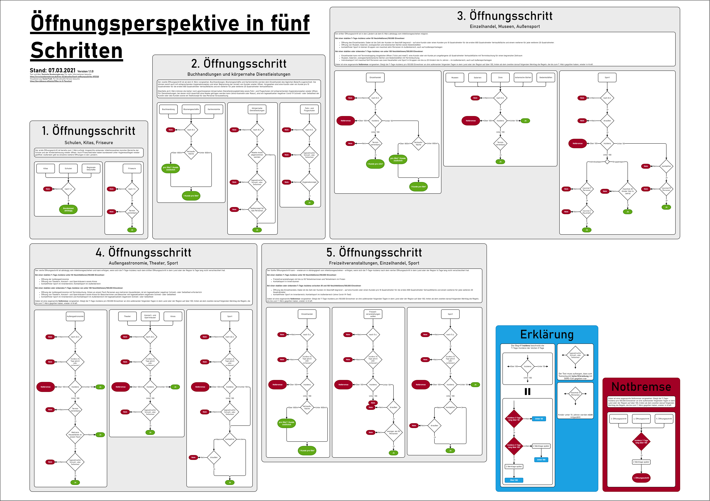
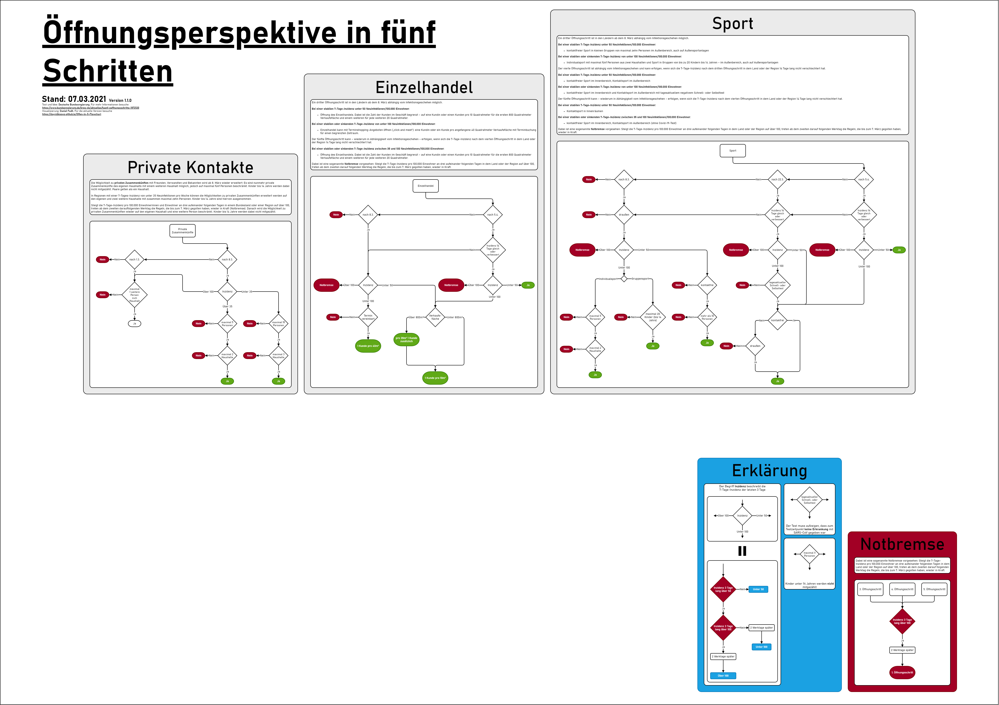
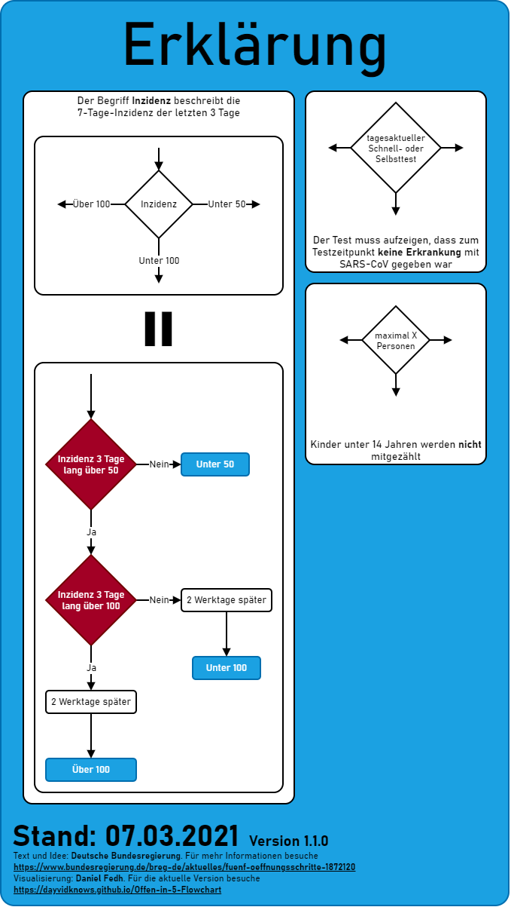
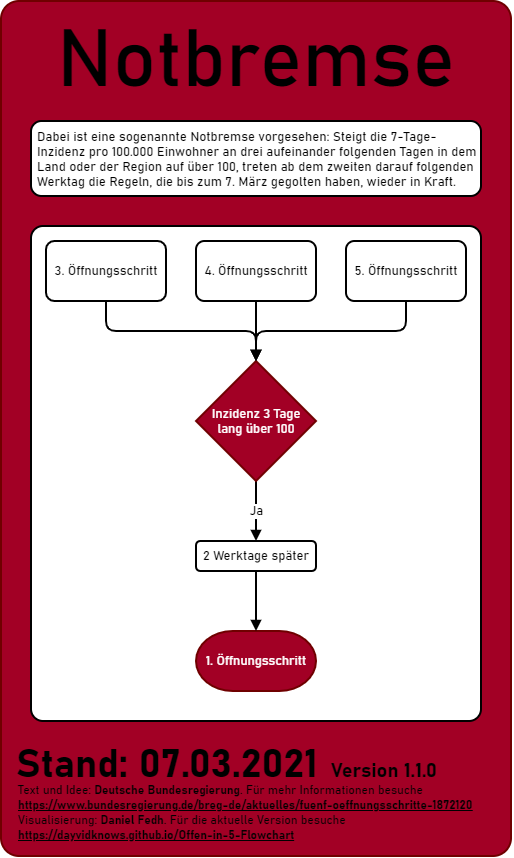
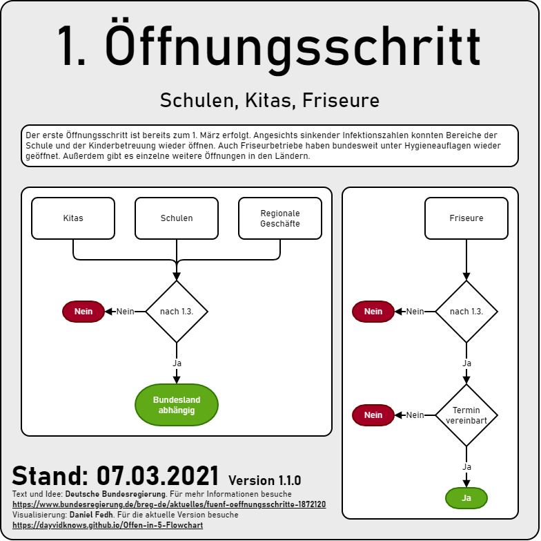
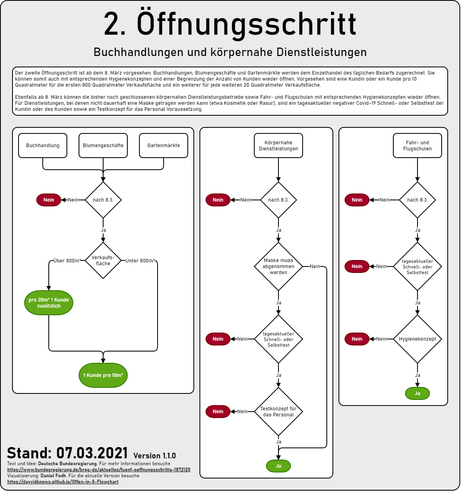
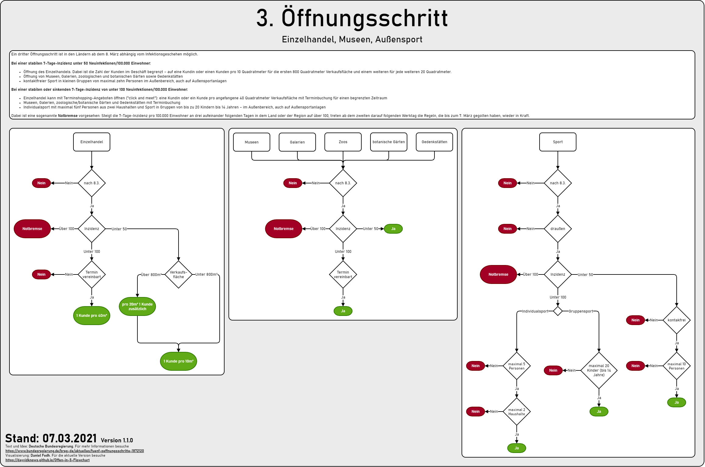
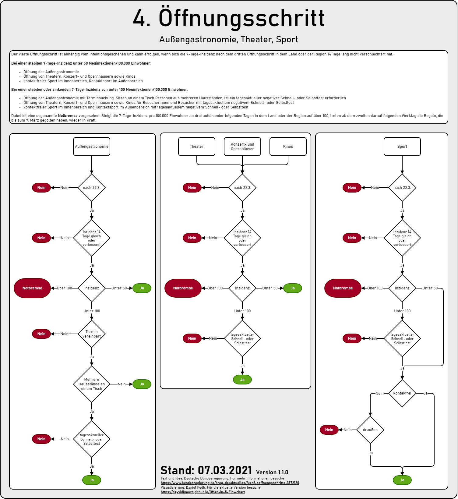

# Öffnungsperspektive in fünf Schritten Flowchart

oder kurz **Offen in 5** ist eine Visualisierung des 'Öffnungsperspektive in fünf Schritten' Konzepts der Deutschen Bundesregierung

Alle Grafiken sind als [png](png) und [pdf](pdf) verfügbar.

## Poster

Neben den einzelnen Schritten gibt es auch **2 Poster**

### Poster 1

[🖼png](png/Poster-1.png) [📄pdf](pdf/Poster-1.pdf): Alle Schritte getrennt voneinander in der Übersicht

### Poster 2

[🖼png](png/Poster-2.png) [📄pdf](pdf/Poster-2.pdf): Die Kategorien Private Kontakte, Einzelhandel, Sport. Schritte übergreifen zusammengefasst

## Erklärung

[🖼png](png/Erklärung.png) [📄pdf](pdf/Erklärung.pdf)

Um die Diagramme kompakt zu halten wurde der Text in ein paar Knoten abgekürzt oder es wurde Funktionalität zusammengefasst. Um dennoch den Regeln der Deutschen Bundesregierung getreu zu sein sind hier diese Knoten erklärt.

## Notbremse

[🖼png](png/Notbremse.png) [📄pdf](pdf/Notbremse.pdf)

Ab dem **3. Öffnungsschritt** gibt es eine sogenannte **Notbremse**, die bei langanhalten, erhöhten Inzidenzwerten die Öffnung **zurücksetzt**.

## 1. Öffnungsschritt

[🖼png](png/Schritt-1.png) [📄pdf](pdf/Schritt-1.pdf)

Im 1. Schritt werden **Schulen, Kitas und regionale Geschäfte** abhängig von den Regeln des Bundeslandes geöffnet. Bei **Friseuren** muss ein Termin vereinbart werden.

## 2. Öffnungsschritt

[🖼png](png/Schritt-2.png) [📄pdf](pdf/Schritt-2.pdf)

Im 2. Schritt werden **Buchhandlungen, Blumengeschäfte, Gartenmärkte** geöffnet. **Fahr- und Flugschulen** werden mit Tests und Hygienekonzepten geöffnet. Bei **körpernahen Dienstleistungen** müssen je nach Behandlung Tests durchgeführt werden.

## 3. Öffnungsschritt

[🖼png](png/Schritt-3.png) [📄pdf](pdf/Schritt-3.pdf)

Im 3. Schritt wird der reguläre **Einzelhandel, Museen, Galerien, Zoos, botanische Gärten, Gedenkstätten** abhängig von der Inzidenz geöffnet. **Sport** ist abhängig von der Inzidenz und der Personenzahl.

Ab diesem Schritt wird die **Notbremse** eingeführt. Diese setzt die bisherigen Eröffnung zurück auf den 1. Schritt, wenn die Inzident längerfristig **über 100** hängt.

## 4. Öffnungsschritt

[🖼png](png/Schritt-4.png) [📄pdf](pdf/Schritt-4.pdf)

Im 4. Schritt wird **Außengastronomie, Theater, Konzert- und Opernhäuser und Kinos** abhängig von der Inzidenz eröffnet. **Sport** ist nur Inzidenz abhängig.

Die **Notbremse** bleibt weiterhin.

## 5. Öffnungsschritt

[🖼png](png/Schritt-5.png) [📄pdf](pdf/Schritt-5.pdf)

Im 5. Schritt wird der reguläre **Einzelhandel** abhängig von der Inzidenz mit großer Toleranz geöffnet. Zu dem werden **Freizeitveranstaltungen im Freien** erlaubt. **Sport** wird nur noch bei einer hohen Inzidenz eingeschränkt.

Die **Notbremse** bleibt weiterhin.

## Quellen

- Artikel: [Öffnungsperspektive in fünf Schritten](https://www.bundesregierung.de/breg-de/aktuelles/fuenf-oeffnungsschritte-1872120)
- Folien: [Bund-Länder-Beschluss vom 3. März 2021](https://www.bundesregierung.de/breg-de/suche/bund-laender-beschluss-vom-3-maerz-2021-1872664)
- Beschluss: [Videoschaltkonferenz der Bundeskanzlerin mit den Regierungschefinnen und Regierungschefs der Länder am 3. März 2021](https://www.bundesregierung.de/resource/blob/975226/1872054/66dba48b5b63d8817615d11edaaed849/2021-03-03-mpk-data.pdf)
