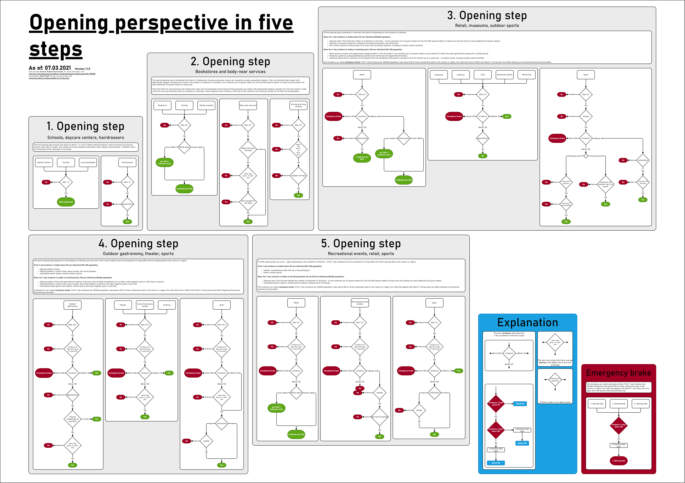
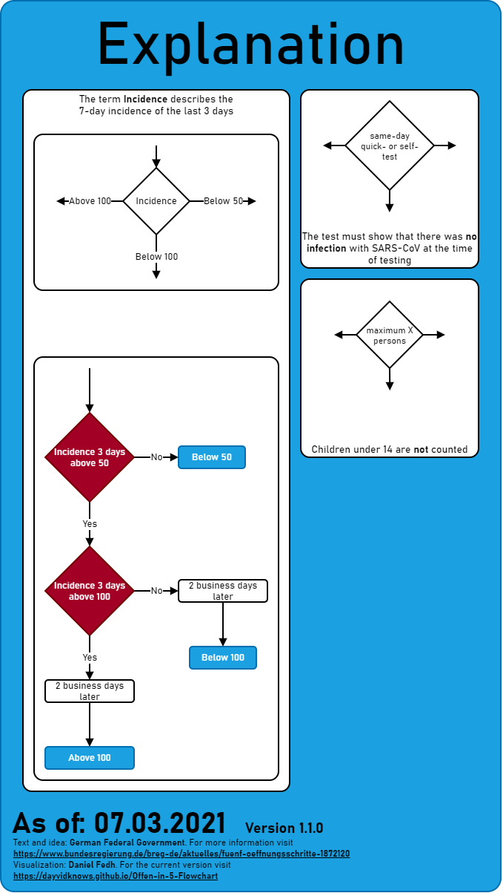
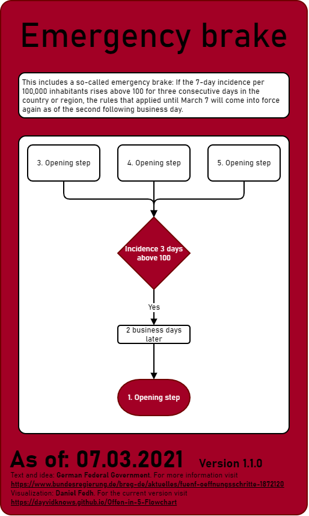
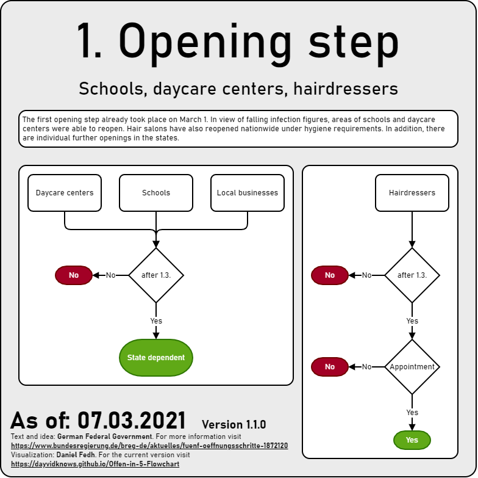
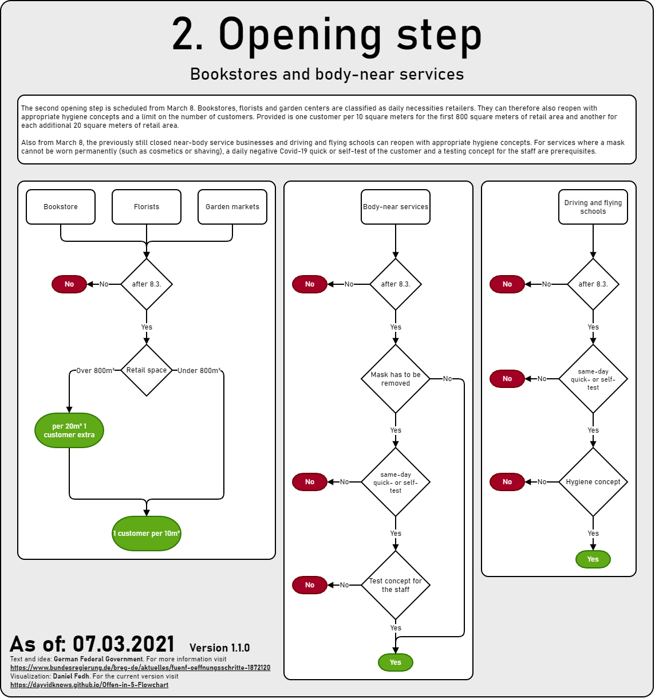
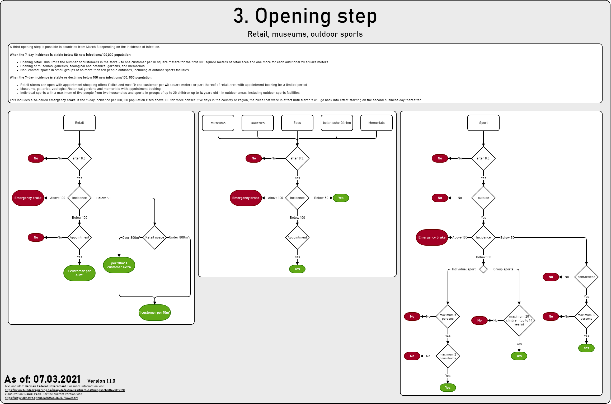
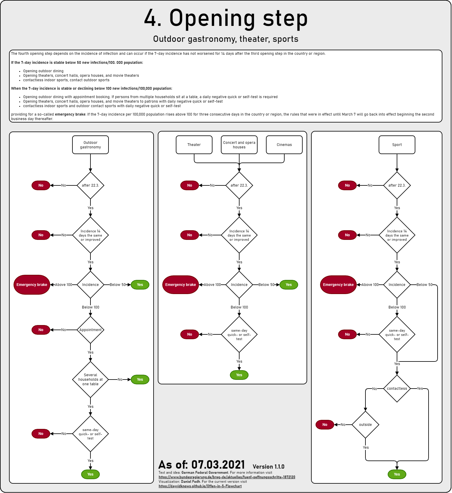
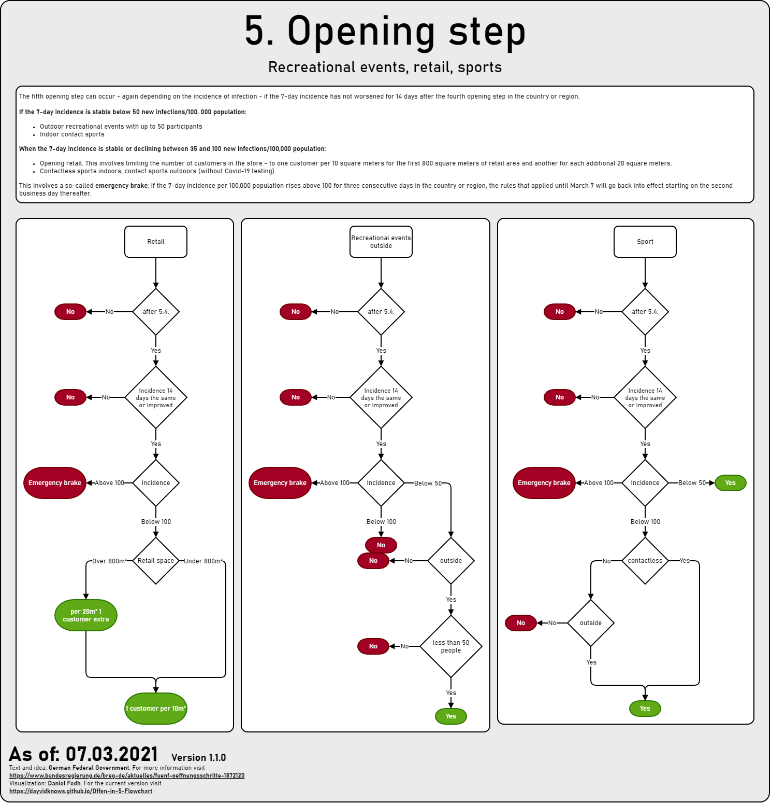

**Offen in 5** is a visualization of the 'Öffnungsperspektive in fünf Schritten' concept of the German Federal Government.

All graphics are available as [png](png) und [pdf](pdf).

## Poster

Neben den einzelnen Schritten gibt es auch **2 Poster**

### Poster 1

[🖼png](png/Poster-1.png) [📄pdf](pdf/Poster-1.pdf): All steps separately in the overview

### Poster 2

[🖼png](png/Poster-2.png) [📄pdf](pdf/Poster-2.pdf): The categories Private Contacts, Retail, Sports. Steps grouped together

## Explanation

[🖼png](png/Explanation.png) [📄pdf](pdf/Explanation.pdf)

To keep the diagrams compact, the text has been abbreviated into a few nodes or functionality has been summarized. To be true to the rules of the German Federal Government, these nodes are explained here.

## Emergency-brake

[🖼png](png/Emergency-brake.png) [📄pdf](pdf/Emergency-brake.pdf)

From the **3rd opening step** on, there is a so-called **emergency brake**, which **resets** the opening in case of long-lasting, increased incidence values.

## 1. Opening Step

[🖼png](png/Step-1.png) [📄pdf](pdf/Step-1.pdf)

In the 1st step **schools, daycare centers and regional shops** are opened depending on the rules of the state. At **hairdressers** an appointment must be made.

## 2. Opening step

[🖼png](png/Step-2.png) [📄pdf](pdf/Step-2.pdf)

In the 2nd step **bookstores, flower stores, garden markets** will be opened. **Driving and flying schools** are opened with tests and hygiene concepts. For **body-near services**, tests must be performed depending on the treatment.

## 3. Opening step

[🖼png](png/Step-3.png) [📄pdf](pdf/Step-3.pdf)

In the 3rd step, regular **retail, museums, galleries, zoos, botanical gardens, memorials** are opened depending on incidence. **Sports** is dependent on incidence and number of people.

From this step, the **emergency brake** is introduced. This resets the previous opening back to the 1st step if the incidence hangs **over 100** for a longer period of time.

## 4. Opening step

[🖼png](png/Step-4.png) [📄pdf](pdf/Step-4.pdf)

In the 4th step, **outdoor restaurants, theaters, concert halls, opera houses, and movie theaters** are opened depending on incidence. **Sports** is incidence dependent only.

The **emergency brake** remains.

## 5. Opening step

[🖼png](png/Step-5.png) [📄pdf](pdf/Step-5.pdf)

In the 5th step, regular **retail** is opened with a large tolerance depending on the incidence. To which **outdoor recreational events** will be allowed. **Sports** will only be restricted if the incidence is high.

The **emergency brake** remains.

## Sources

- Article: [Öffnungsperspektive in fünf Schritten](https://www.bundesregierung.de/breg-de/aktuelles/fuenf-oeffnungsschritte-1872120)
- Slides: [Bund-Länder-Beschluss vom 3. März 2021](https://www.bundesregierung.de/breg-de/suche/bund-laender-beschluss-vom-3-maerz-2021-1872664)
- Resolution: [Videoschaltkonferenz der Bundeskanzlerin mit den Regierungschefinnen und Regierungschefs der Länder am 3. März 2021](https://www.bundesregierung.de/resource/blob/975226/1872054/66dba48b5b63d8817615d11edaaed849/2021-03-03-mpk-data.pdf)
